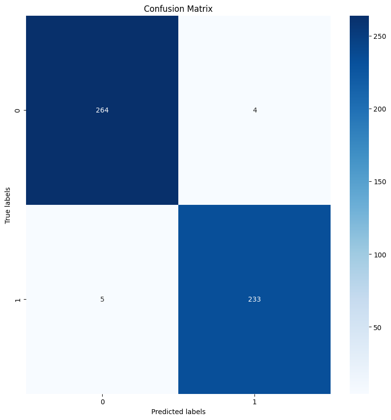

مشروع تخرّجي في البكالوريوس: مصنّف ثنائي بلغة Python باستخدام TensorFlow و Keras، يحدّد ما إذا كانت صورة الأشعة تُظهر كسراً.

- **البيانات:** 9,243 صورة للتدريب و829 للتحقق و506 للاختبار، من مناطق مختلفة في الجسم، بحجم 224 × 224.
- **النموذج:** تعلّم بالنقل على قاعدة VGG16 مجمّدة ومدرّبة مسبقاً على ImageNet، تليها طبقتان التفافيتان مخصّصتان وطبقات كثيفة صغيرة مع Dropout وتنظيم L2.
- **التدريب:** محسّن Adam، حتى 20 دورة مع إيقاف مبكر حسب خسارة التحقق.
- **التقييم:** الدقة والضبط والاستدعاء و F1 على مجموعة اختبار لم تُستخدم في التدريب.

*مصفوفة الالتباس على مجموعة الاختبار: 497 صورة من أصل 506 صُنّفت بشكل صحيح.*

*صور التدريب من مجموعة بيانات Bone Fracture Multi-Region X-ray Data للمستخدم bmadushanirodrigo على Kaggle، منشورة برخصة الملكية العامة ODC PDDL.*
