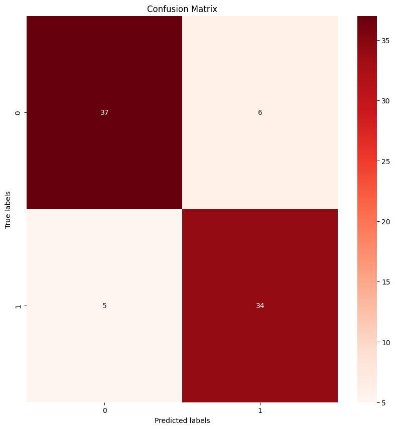

نظام فحص آلي يصنّف صور العين حسب مرحلة الساد: غير ناضج أو ناضج.

- **البيانات:** 410 صور عين موسومة بحجم 416 × 416، قُسّمت بنسبة 80/20 إلى 328 صورة تدريب و82 صورة اختبار مع الحفاظ على توازن الفئات.
- **النموذج:** قاعدة VGG16 مجمّدة ومدرّبة مسبقاً على ImageNet، تليها طبقتان التفافيتان مخصّصتان وطبقات كثيفة مع Dropout وتنظيم L2.
- **التدريب:** محسّن Adam لمدة 20 دورة.

*مصفوفة الالتباس على مجموعة الاختبار: 71 صورة من أصل 82 صُنّفت بشكل صحيح.*

*صور العين من مجموعة Cataract Classification Dataset للمستخدم akshayramakrishnan28 على Kaggle، برخصة CC BY-SA 4.0. شبكة الصور مقتبسة من دفتري على Kaggle ومنشورة بالرخصة نفسها.*
