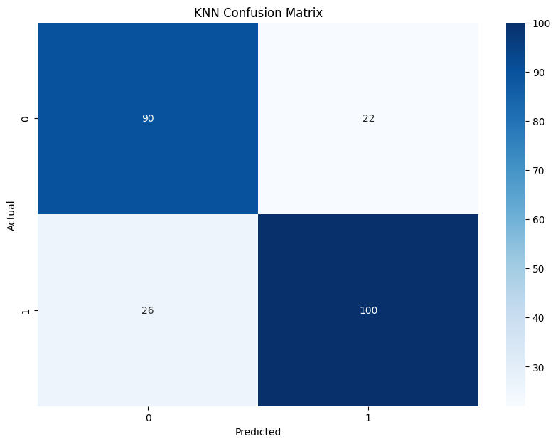

- عالجت مجموعة بيانات سريرية من 1,190 سجلاً لمرضى ووحّدت قيمها باستخدام Python و Pandas و scikit-learn، مع ترميز الأعمدة الفئوية.
- قسّمت البيانات بنسبة 80/20 مع الحفاظ على توازن الفئات، فبقي 238 سجلاً للاختبار.
- درّبت مصنّف أقرب الجيران (بعد البحث عن أفضل عدد للجيران) ومصنّف بايز الساذج (Gaussian Naive Bayes) وقارنت بينهما.

*أقرب الجيران: 190 سجلاً من أصل 238 صُنّفت بشكل صحيح.*
